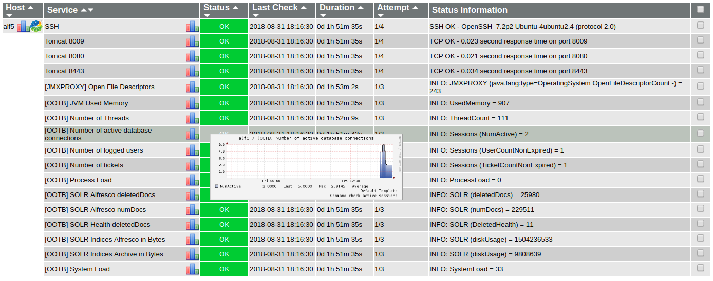
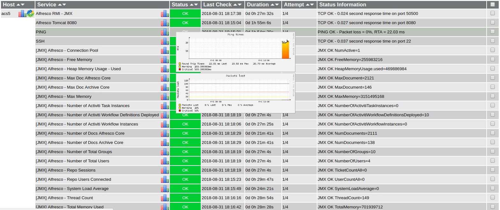
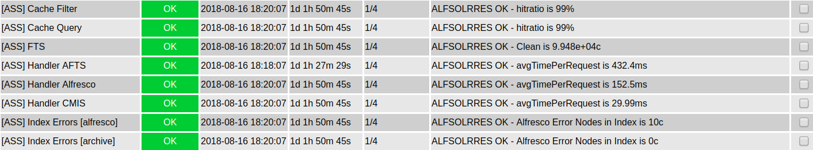

# Nagios setup for Alfresco

## Table of Contents
- [Introduction](#introduction)
- [Nagios-Icinga configuration for Alfresco Community](#nagios-icinga-configuration-for-alfresco-community)
- [Nagios-Icinga configuration for Alfresco Enterprise](#nagios-icinga-configuration-for-alfresco-enterprise)
- [Alfresco Search Services](#alfresco-search-services)
- [Using Dockerfile](#using-dockerfile)
- [Using Vagrantfile](#using-vagrantfile)
- [Tested on](#tested-on)
- [Author](#author)
- [Links](#links)

## Introduction

A well known example for Alfresco monitoring via JMX is available [here](https://github.com/toniblyx/alfresco-nagios-and-icinga-plugin), but the most interesting information for this is related to Enterprise Edition (EE). General direct monitoring commands (not JMX-based) may be used for Community Edition (CE) too. We can obtain additional monitoring information for Alfresco Community via OOTB Support Tools webscripts (System Performance, Active Sessions and SOLR).

## Nagios-Icinga configuration for Alfresco Community

The files involved in Nagios/Icinga configuration for Alfresco Community are the following:

- objects/hosts-alfresco.cfg (Alfresco hosts definition)
- objects/commands-ootb.cfg (Nagios commands)
- objects/services-ootb.cfg (Non NRPE services)
- objects/commands-ass.cfg (Nagios commands for Alfresco Search Services)
- objects/services-ass.cfg (Non NRPE services for Alfresco Search Services)
- nrpe/nrpe-ootb.cfg (NRPE services)
- nrpe/nrpe.cfg (For nrpe-server - only if NRPE)

By the way, shell/python scripts are usually placed at /usr/lib/nagios/plugins/

- scripts/check_ootb_performance_stats.sh
- scripts/check_ootb_active_sessions.sh
- scripts/check_ootb_solr.sh
- scripts/check_manager_jmxproxy.sh (JMX monitoring)
- scripts/check_alfresco_solr.py

For using this setup you need some dependencies like curl, jshon, python-nagiosplugin or python-urllib3 in your Nagios Server. 

Note: If you plan to use NRPE config, you need to configure your Alfresco Server as a Nagios NRPE server.

### OOTB Support Tools webscripts
 
With [OOTB Support Tools addon for Alfresco Community Edition](https://github.com/OrderOfTheBee/ootbee-support-tools), it is possible to extract useful information about JVM, threads, logged users or SOLR via curl command, for generating alerts and graphs in Nagios. We can use the JSON information from the available webscripts of the addon:

- JVM Used Memory
- Number of Threads
- Number of active database connections
- Number of logged users
- Number of tickets
- Process Load
- System Load
- SOLR numDocs (for any core)
- SOLR deletedDocs
- SOLR Health
- SOLR indices size (for any core)



For consuming OOTB webscripts, you need to create a dedicated user for Alfresco Monitoring, for example monitor, with admin rights (belonging to ALFRESCO_ADMINISTRATORS group). Take into consideration that this password is used in Nagios scripts. You should use SSL in http requests, or running monitoring processes locally in Alfresco server via NRPE protocol (safer). 

Previously you need to install [OOTB Support Tools addon](https://github.com/OrderOfTheBee/ootbee-support-tools) in your Alfresco CE server.

### JMXProxy servlet

[With JMX Proxy Servlet](https://tomcat.apache.org/tomcat-7.0-doc/manager-howto.html#Using_the_JMX_Proxy_Servlet) enabled in Alfresco Community, you may get JMX information about Garbage Collector, Memory, Threads or Operating System in your Tomcat instance. The essential info may be obtained from OOTB Support Tools webscripts too, but other important parameters from Operating System or Garbage Collector may be extracted this way. Please note that this JMX information is related to the default mbeans in a Tomcat container, and not related to the Alfresco JMX objects contained in Alfresco Enterprise (aka Alfresco Content Services). 

For illustrating this, we will monitor the number of opened file descriptors in the operating system. It is also an alternative to [Jolokia](https://jolokia.org/tutorial.html) or check_jmx methods.

## Nagios-Icinga configuration for Alfresco Enterprise

The files involved in Nagios/Icinga configuration for Alfresco Enterprise are the following:

- jmx/hosts-alfresco.cfg (Alfresco hosts definition)
- jmx/commands-jmx.cfg (Nagios commands)
- jmx/services-jmx.cfg (Non NRPE services)

By the way, check_alfresco script and check_alfresco.jar is usually placed at /usr/lib/nagios/plugins/

Finally, you need to have Java installed on your Nagios-Icinga server for executing check_alfresco script, and to enable JMX in Alfresco Server. For more details, you can check [Alfresco docs](https://docs.alfresco.com/5.0/tasks/jmx-access.html)



## Alfresco Search Services

Alfresco Search Services are monitored via [check_alfresco_solr.py](https://github.com/alxgomz/nagios-plugin-alfresco-search-services) script by Alexandre Chapellon. The python script helps to monitor index, handlers, FTS and caches values. It is valid both for Alfresco Community and Alfresco Enterprise. 



You may find more details in Alfresco Premier Services blog post:
- [Solr monitoring using Nagios and alikes](https://community.alfresco.com/blogs/alfresco-premier-services/2018/08/08/solr-monitoring-using-nagios-and-alikes)

## Using Dockerfile

You can check this basic Nagios/Icinga setup using Docker in Ubuntu 16.04 LTS. It includes a template for using it in Alfresco Enterprise via check_jmx, and also in Alfresco Community via OOTB Support Tools webscripts and JMXProxy. You need to enable JMX in Alfresco Enterprise, and to install OOTB Support Tools addon and JMXProxy in Alfresco Community targets. 

0. Clone this project
```
$ git clone https://github.com/zylklab/alfresco-nagios
$ cd alfresco-nagios
```

1. Configure Alfresco templates in Dockerfile according to your Alfresco repository targets to monitor.

```
##
## Icinga Config
##
ENV ICINGA_CONFIG /etc/icinga/objects
ENV ICINGA_PLUGIN /usr/lib/nagios/plugins
ENV ICINGA_ADMIN admin 

##
## Alfresco Community Template
## 
ENV ALF_HOST alf-ce.melmac.net 
ENV ALF_PORT 8080 
ENV ALF_ADDR 127.0.0.1
# Alfresco admin user for monitoring
ENV ALF_USER monitor
ENV ALF_PASS secret
# Alfresco JMXProxy manager user
ENV JMXPROXY_USER manager
ENV JMXPROXY_PASS s3cret

##
## Alfresco Enterprise Template
##
ENV ACS_HOST alf-ee.melmac.net 
ENV ACS_ADDR 127.0.0.1 
# JMX User
ENV JMX_USER monitorRole
ENV JMX_PASS change_asap 

##
## Alfresco Search Services
## 
ENV ASS_HOST ass.melmac.net
ENV ASS_PORT 8983
ENV ASS_ADDR 127.0.0.1
```

2. Run docker commands

```
$ sudo docker build -t zylklab/icingalf .
$ sudo docker run -i -t zylklab/icingalf
```

3. Login http://docker-server-ip/icinga (by default http://172.17.0.2/icinga) with icingaadmin/admin credentials. 

Note: Take into consideration that email alerts are not configured. You should configure postfix and Icinga/Nagios contacts.

## Using Vagrantfile

Other way of testing this setup is via Vagrantfile. This creates a Virtualbox VM based on Ubuntu 14.04 LTS and it provisions the needed Icinga installation and configuration. The template variables for the Alfresco targets are included in scripts/icinga-provision-script.sh  

```
$ git clone https://github.com/zylklab/alfresco-nagios
$ cd alfresco-nagios
# Edit scripts/icinga-provision-script.sh for setting Alfresco target vars
$ vagrant up
$ vagrant ssh
# Once you finish you may exit VM, vagrant halt (or even vagrant destroy -f)
```

Then login in http://vagrant-server-ip/icinga (or http://localhost:8080/icinga) with icingaadmin/admin credentials

## Tested on

- Alfresco 2017XXGA + OOTB Support Tools Addon >0.1
- Alfresco 5.0.25 EE 
- Nagios/Icinga 3 
- PNP4Nagios 0.6.0
- Docker version 1.12.6
- Vagrant 1.8.1 
- Ubuntu 14.04 LTS

## Author

- [Cesar Capillas](http://github.com/CesarCapillas)

## Links

- [Alfresco Nagios Setup for Alfresco Enterprise](https://github.com/toniblyx/alfresco-nagios-and-icinga-plugin)
- [OOTB Support Tools](https://github.com/OrderOfTheBee/ootbee-support-tools)
- [Using the JMX Proxy Servlet](https://tomcat.apache.org/tomcat-7.0-doc/manager-howto.html#Using_the_JMX_Proxy_Servlet)
- [Enabling JMX in Alfresco Enterprise](https://docs.alfresco.com/5.0/tasks/jmx-access.html)
- [Blog Post - How to use JMX in Alfresco](https://www.zylk.net/en/web-2-0/blog/-/blogs/enabling-jmx-in-alfresco)
- [Blog Post - Monitoring Alfresco in Nagios via OOTB Support Tools](http://www.zylk.net/es/web-2-0/blog/-/blogs/monitoring-alfresco-in-nagios-via-ootb-support-tools-addon)
- [Blog Post - More on monitoring Alfresco in Nagios via OOTB Support Tools](http://www.zylk.net/es/web-2-0/blog/-/blogs/more-on-monitoring-alfresco-in-nagios-via-ootb-support-tools)
- [Solr monitoring using Nagios and alikes](https://community.alfresco.com/blogs/alfresco-premier-services/2018/08/08/solr-monitoring-using-nagios-and-alikes)
- [Nagios plugin for Alfresco Search Services](https://github.com/alxgomz/nagios-plugin-alfresco-search-services)
